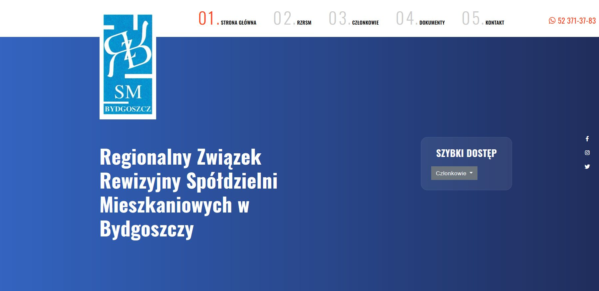

# Dillinger
## _The Last Markdown Editor, Ever_

# Regonalny Związek Rewizyjny w Bydgoszczy
Web page. Basic information about the Association plus Members. 

## Table of contents
* [General info](#general-info)
* [Screenshots](#screenshots)
* [Technologies](#technologies)
* [Setup](#setup)
* [Features](#features)
* [Status](#status)
* [Inspiration](#inspiration)
* [Contact](#contact)

## General info
An organization gathering mainly cooperatives from the Kujawsko-Pomorskie voivodship. Character of the website is typically informative .

## Screenshots

## Technologies
* HTML 5 
* CSS 3
* PHP
* JS
* Bootstrap

## Setup
https://rzrsm.bydgoszcz.com

## Code Examples
Show examples of usage:
`<!DOCTYPE html>
<html lang="en">
<head>
   <!-- Meta Tags -->
   <meta charset="utf-8">
   <meta content="width=device-width, initial-scale=1, shrink-to-fit=no" name="viewport">
   <!-- Author -->
   <meta name="author" content="IT HELP">
   <!-- description -->
   <meta name="description" content="Regionalny Związek Rewizyjny Spółdzielni Mieszkaniowych w Bydgoszczy">
   <!-- keywords -->
   <meta name="keywords" content="Regionalny Związek Rewizyjny, Spółdzielnie, Bydgoszczy, Regionalny Związek Rewizyjny Spółdzielni Mieszkaniowych">
   <meta name="robots" content="all">
   <!-- Page Title -->
   <title>Regionalny Związek Rewizyjny Spółdzielni Mieszkaniowych w Bydgoszczy</title>
    <!-- Favicon -->
    <link href="img/favicon.ico" rel="icon">
    <!-- Bundle -->
    <link href="vendor/css/bundle.min.css" rel="stylesheet">
    <!-- Plugin Css -->
    <link href="vendor/css/LineIcons.min.css" rel="stylesheet">
    <link href="vendor/css/select2.min.css" rel="stylesheet">
    <link href="vendor/css/revolution-settings.min.css" rel="stylesheet">
    <link href="vendor/css/jquery.fancybox.min.css" rel="stylesheet">
    <link href="vendor/css/wow.css" rel="stylesheet">
    <link href="vendor/css/owl.carousel.min.css" rel="stylesheet">
    <link href="vendor/css/cubeportfolio.min.css" rel="stylesheet">

    <!-- Style Sheet -->
    <link href="css/bootstrap-select.min.css" rel="stylesheet">
    <link href="css/sweetalert2.min.css" rel="stylesheet">
    <link href="css/style.css" rel="stylesheet">`

## Features
List of features ready and TODOs for future development
To-do list:
* email form
* news
* social media

## Status
Project is: _in progress_, 

## Inspiration
Project built on the template with Envato

## Contact
Created by [@ithelparturgolata](ithelparturgolata@gmail.com) - feel free to contact me!
